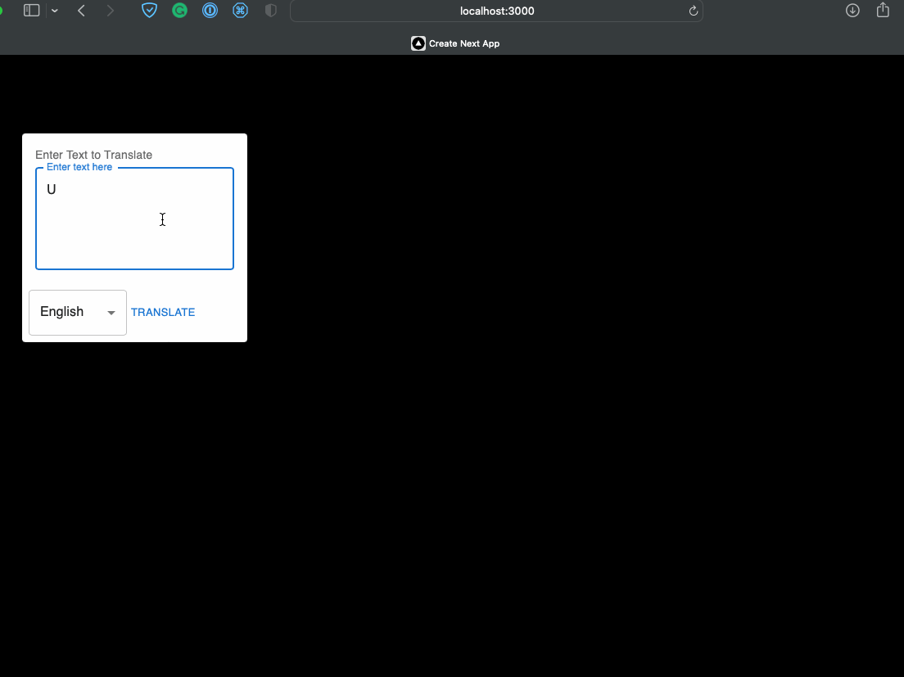

# Project Overview

Welcome to the Customer Service Multi-language Translator! This application, powered by Next.js, serves to interpret customer inquiries in your chosen language.

## How It Functions

The website uses Next.js routing to send API calls to ChatGPT. User inputs on the form trigger the API at `http://localhost:3000/openai` which instructs ChatGPT to translate the text via a straightforward prompt. Find additional details in the [`route.ts`](./app/openai/route.ts) file.

## Starting the Project

1. Install necessary dependencies using the `yarn install` command.

2. Copy the contents of the [.env.example](./.env.example) file into a new file called `.env.local`. Update this new file with your ChatGPT [API key](https://platform.openai.com/account/api-keys).

3. Launch the development server with one of the following commands:

`npm run dev`

`yarn dev`

`pnpm dev`

4. Navigate to [http://localhost:3000](http://localhost:3000) in your web browser to view the live website.

You can start editing the website by modifying the `app/page.tsx` file. Any changes will automatically update on the page.

This project leverages [`next/font`](https://nextjs.org/docs/basic-features/font-optimization) to automatically optimize and load Inter, a custom Google Font.

## Deploying on Vercel

For the easiest way to deploy your Next.js application, use the [Vercel Platform](https://vercel.com/new?utm_medium=default-template&filter=next.js&utm_source=create-next-app&utm_campaign=create-next-app-readme), straight from the creators of Next.js.

For more detailed instructions, refer to the [Next.js deployment documentation](https://nextjs.org/docs/deployment).
